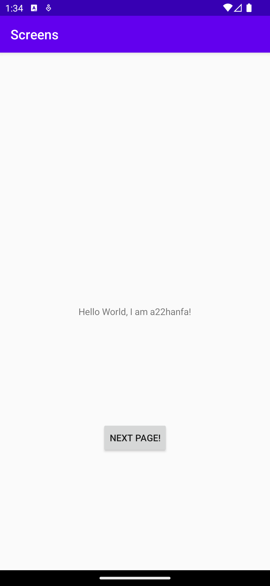
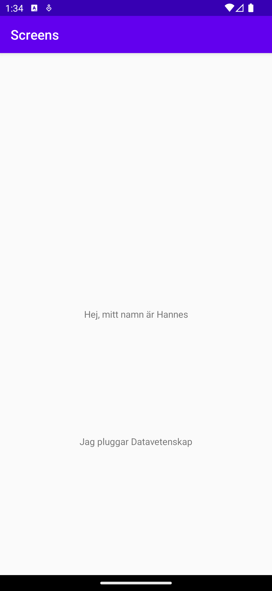

# Rapport
I denna rapport går vi igenom hur vi har implementerat en Android-app med två aktiviteter och skickat data mellan dem.

Methoderna som används är Intent och putExtra() för att skicka data mellan de olika aktiviteterna. Datan skickas genom att klicka på knappen.
```
@Override
    protected void onCreate(Bundle savedInstanceState) {
        super.onCreate(savedInstanceState);
        setContentView(R.layout.activity_main);

        Button button = findViewById(R.id.button);
        button.setOnClickListener(view -> {
            Intent intent = new Intent(MainActivity.this, SecondActivity.class);
            intent.putExtra("Name", "Hej, mitt namn är Hannes");
            intent.putExtra("Program", "Jag pluggar Datavetenskap");
            startActivity(intent);
        });

    }
```

I `activity_main.xml` skapas en textView och button.
```
<TextView
        android:id="@+id/textView".../>

<Button
        android:id="@+id/button".../>
```

Den sekundära aktiviteten skapades genom att en activity lades till i `AndroidManifest.xml`.
```
<activity
            android:name=".SecondActivity"
            android:exported="false">
        </activity>
```

I `SecondActivity` hämtas intent ifrån MainActivity och med hjälp av methoden getStringExtra() hämtas strängarna och sedan sätts texten på textView objekten till strängarna.
```
    protected void onCreate(Bundle savedInstanceState) {
        super.onCreate(savedInstanceState);
        setContentView(R.layout.activity_secondary);

        Intent intent = getIntent();
        String nameValue = intent.getStringExtra("Name");
        String programValue = intent.getStringExtra("Program");

        TextView textViewName = findViewById(R.id.textViewName);
        textViewName.setText(nameValue);

        TextView textViewProgram = findViewById(R.id.textViewProgram);
        textViewProgram.setText(programValue);
    }
```

I `activity_secondary.xml` skapas textView-objekten.
```
<TextView
        android:id="@+id/textViewName"...
        />

    <TextView
        android:id="@+id/textViewProgram"...
        />
```

Here are the final product:
